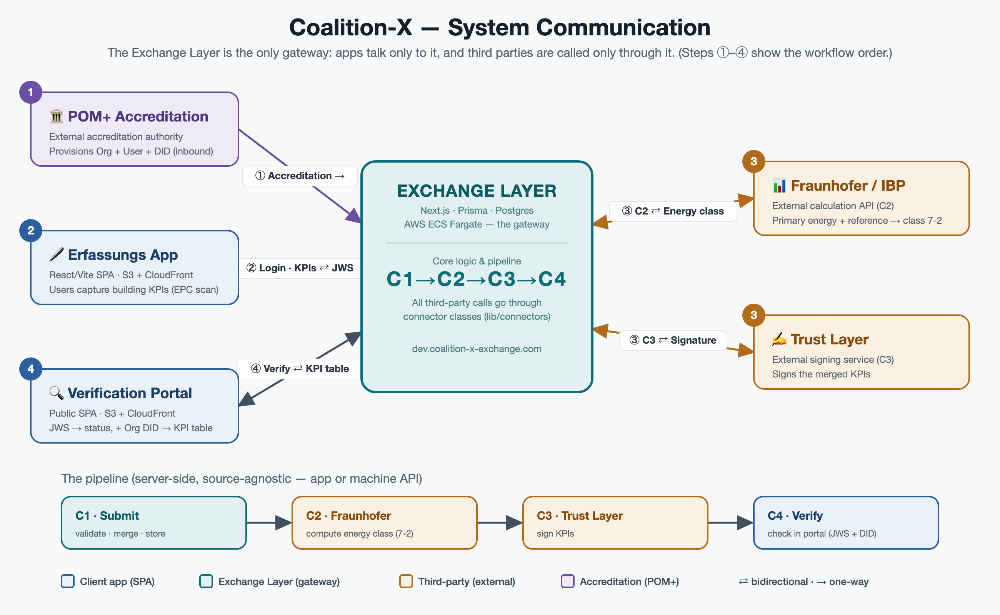

# Coalition-X — System & Communication Overview

> **Purpose:** knowledge-transfer for the team. It explains the five systems, who
> talks to whom, and the end-to-end KPI flow (C1 → C2 → C3 → C4). Everything here
> reflects the deployed state as of July 2026.

---

## The one rule that explains the whole architecture

**The Exchange Layer is the only gateway. Every app talks *only* to the Exchange
Layer, and every third-party call goes *only* through the Exchange Layer.**

The Erfassungs App and the Verification Portal never call Fraunhofer, the Trust
Layer, or POM+ directly. Third parties are wrapped in connector classes on the
server (`lib/connectors/*`). This keeps auth, secrets, CORS, and data governance
in one place.

---

## The five systems at a glance

| System | What it is | Talks to |
|---|---|---|
| **Erfassungs App** | React/Vite SPA where users enter a building's KPIs (incl. EPC/Energieausweis scraping). Hosted on S3 + CloudFront. | Exchange Layer only |
| **Verification Portal** | Public React/Vite SPA. Given a token, shows a submission's status; given the token + Org DID, shows the full signed KPI table. S3 + CloudFront. | Exchange Layer only |
| **Exchange Layer** | Next.js / Prisma / Postgres on AWS ECS Fargate. The central gateway + business logic + the C1→C4 pipeline. | Everyone (hub) |
| **Fraunhofer (IBP)** | External calculation API. Turns primary-energy + reference numbers into an energy-efficiency class. Stateless, synchronous, no auth. | Called by Exchange Layer (C2) |
| **POM+ Accreditation** | External accreditation authority. Pushes accredited-partner data (org + user + **DID**) into the Exchange Layer so partners can log in. | Calls Exchange Layer (inbound) |

> The **Trust Layer** (C3, digital signing) is a sixth external service in the
> pipeline — included below because the flow is incomplete without it.

---

## Communication diagram

> Source: [`docs/architecture.svg`](docs/architecture.svg) (edit this; the PNG is a
> render of it). To regenerate the PNG from the SVG:
> `"/Applications/Google Chrome.app/Contents/MacOS/Google Chrome" --headless --screenshot=docs/architecture.png --window-size=1300,800 --force-device-scale-factor=2 file://$PWD/docs/architecture.svg`

---

## Communication reference (every edge)

| From → To | Endpoint / call | Auth | Purpose |
|---|---|---|---|
| Erfassungs App → Exchange | `POST /api/auth/login-did` | email + DID | Log in; returns OAuth access/refresh tokens (scopes from the user's role, incl. `submissions:read`). |
| Erfassungs App → Exchange | `POST /api/assets/kpis` | Bearer | Submit a building's KPIs (creates asset if new). Runs the full C1→C3 pipeline; returns a **JWS tracking token** + validation status. |
| Erfassungs App → Exchange | `GET /api/submissions` | Bearer | The org's submission history (so the status page survives reload). |
| Exchange → Erfassungs App | *(response)* | — | JWS tracking token, `validationStatus`, `signingStatus`. |
| Verification Portal → Exchange | `POST /api/submissions/track` | **public** (JWS is the credential) | Step 1: JWS → submission summary (address, status, validity, `fraunhofer` status). |
| Verification Portal → Exchange | `POST /api/verify/kpis` | **public**, gated on Org DID | Step 2: JWS + Org DID → full KPI table with per-KPI `verified` flag. 403 if DID ≠ submission's org DID. |
| POM+ → Exchange | `POST /api/partner-requests` | Bearer, scope `partner:org-sync` (restricted to `POM_PARTNER_ORG_ID`) | Provision an accredited partner: create Organization + User + **DID** + OAuth credentials. **Inbound only.** |
| Exchange → Fraunhofer | `POST {FRAUNHOFER_API_URL}/CalculateEnergyClassFraunhoferMethod` | none | **C2** — send primary energy + reference (Anforderungswert); receive energy class (KPI 7-2). |
| Exchange → Trust Layer | `signSubmittedKpis()` (connector) → `{TRUST_LAYER_URL}` | Trust Layer token | **C3** — sign the merged KPI record; receive the signature. |

---

## The C1 → C2 → C3 → C4 pipeline

This is the heart of the system. It runs server-side on every submission,
**source-agnostic** — identical whether the request came from the Erfassungs App
browser or a machine/API call.

| Step | Name | Where | What happens |
|---|---|---|---|
| **C1** | Submit | Exchange Layer | Normalize → validate (ZIA schema) → merge with existing data → store the KPI record. Entry point: `KpiService.submitKpiWithValidation`. |
| **C2** | Fraunhofer calc | Exchange → Fraunhofer | Read primary energy (7-4 Bedarf / 7-3 Verbrauch) + reference value → call Fraunhofer → write the computed **energy class (KPI 7-2)** into the record. `lib/connectors/FraunhoferService.ts`. Runs **before** C3 so the class is signed. Never fails the submission — a Fraunhofer error is recorded, not thrown. |
| **C3** | Sign | Exchange → Trust Layer | Sign the merged KPI record (which now includes the Fraunhofer class). `lib/connectors/KpiSigningService.ts`. |
| **C4** | Verify | Verification Portal → Exchange | External party verifies with the JWS tracking token (+ Org DID for full detail). Signature re-checked server-side. |

**C2 only fires when the submission carries *both*** a primary-energy value **and**
the reference value (`extended_max_primary_energy_calculated` / `_metered`). The
Erfassungs App now makes the reference (Anforderungswert) a required, autofilled-
if-scraped field. Submissions without it succeed but skip the class calculation.

---

## Identity & accreditation (how DIDs get into the system)

1. **POM+** accredits a partner and calls `POST /api/partner-requests`.
2. The Exchange Layer creates the `Organization` (type `ACCREDITED_PARTNER`), a
   `User`, OAuth credentials, and an `AccreditedPartner` record that stores the
   partner's **DID** (`lib/services/partner-request.service.ts`).
3. The user logs into the **Erfassungs App** with email + that DID
   (`loginWithDid`). Scopes come from their role (`ROLE_SCOPES`).
4. When someone verifies in the **Verification Portal**, step 2 resolves the
   submission's org DID from that same `AccreditedPartner` record
   (`resolveOrgDid`) and only reveals the KPI table if the entered DID matches.

So POM+ is the single source of truth for *who is accredited* and *their DID*.

---

## Where results are visible

- **Fraunhofer energy class (KPI 7-2):** stored on the KPI record
  (`Energy_Performance.KPI_7_2_Energy_Class`, `Source: "FraunhoferMethode"`);
  shown in the Verification Portal's detailed KPI table (after Org DID); also in
  the `track` API response as `fraunhofer: { status, energyClass }`; audit row in
  the `FraunhoferRequest` table; and CloudWatch logs.
- **Signature / verification status:** `signingStatus` on the record; surfaced in
  the portal summary (Verifiziert / Ungültig / In Bearbeitung).

---

## Deployment & infra quick facts

| Thing | Value |
|---|---|
| Exchange Layer | Next.js on **ECS Fargate**, `https://dev.coalition-x-exchange.com`. Deploy: `scripts/deploy-to-ecr.sh` (build → ECR → migrate → force new deployment). Env changes: `terraform apply` (targeted to task def + service to avoid replacing the bastion). |
| Erfassungs App | S3 + CloudFront (OAC), `https://erfassung.coalition-x.eu`. Deploy: `./deploy.sh`. |
| Verification Portal | S3 + CloudFront (OAC), `https://verify.coalition-x.eu`. Deploy: `./deploy.sh`. Repo: `github.com/realcubeGmbH/verification-portal`. |
| Fraunhofer | `FRAUNHOFER_API_URL=https://ibpcoalitionx.azurewebsites.net` (ECS task env). Empty disables C2. |
| CORS | Exchange Layer allows the two SPA origins via `CORS_ALLOWED_ORIGINS` (Terraform `var.cors_allowed_origins`). Any new front-end origin must be added here. |
| AWS account | `053613611368`, region `eu-central-1`. |

---

## Gotchas / things the next person should know

- **Only the Exchange Layer holds secrets and third-party credentials.** Don't add
  direct third-party calls from the SPAs — add a connector on the server instead.
- **`verify.coalition-x.eu` DNS** lives at an external provider (IONOS), not Route 53.
  The CNAME → CloudFront must be maintained there; only the exchange domain is in
  this AWS account's Route 53.
- **Terraform state is local** (S3 backend commented out). A full `terraform apply`
  wants to replace the bastion due to AMI drift — use targeted applies for routine
  changes (`-target=aws_ecs_task_definition.app -target=aws_ecs_service.app`).
- **The JWS tracking token** is signed HS256 with `JWT_SECRET`, audience
  `submission-tracking`. It is the credential the Verification Portal trusts.
- **CAPTCHA / rate-limiting** on the public portal endpoints is not yet implemented
  (flagged for later).
- **`GET /api/submissions` is org-wide**, not per-user — every member of an org sees
  all its submissions. Change the query filter if you need per-user scoping.
