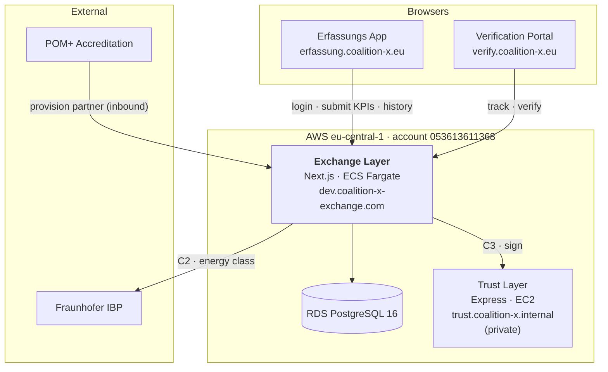
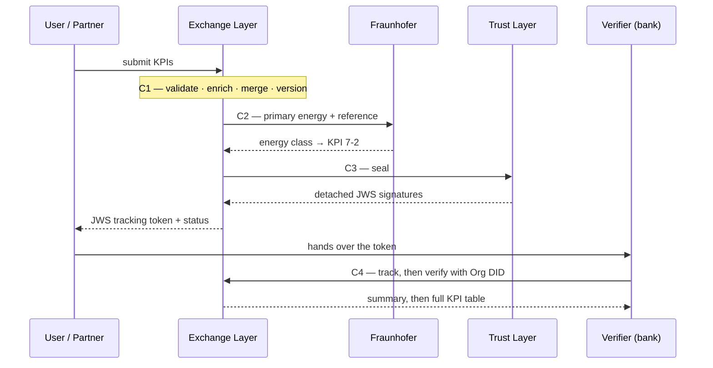
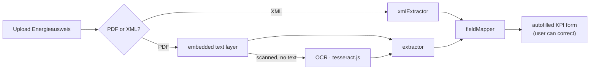

# 📘 Coalition-X — Project Documentation

> **Putting this into Notion:** paste the whole file into one page, then turn each
> `# H1` block into its own sub-page (`Turn into → Page`). Tables, code blocks and
> dividers convert automatically. Mermaid diagrams render in a `/code` block with
> the language set to **Mermaid**. Delete this callout afterwards.

**Reflects the deployed state as of July 2026.** Keep the changelog at the bottom current.

---

# 1. What Coalition-X Is

A **multi-tenant platform for real-estate sustainability KPIs**, built on the
**ZIA standard** (Zentraler Immobilien Ausschuss, Germany).

**The problem:** a building's sustainability data — energy demand, emissions,
floor areas, retrofit history — lives in PDFs, spreadsheets and partner systems.
Banks, investors and asset managers need it **standardised, validated and
cryptographically signed** so they can trust it without trusting the sender.

**What the platform does, in four steps:**

| | Step | How |
|---|---|---|
| 1 | **Capture** building KPIs | Guided German UI (Erfassungs App) with automatic Energieausweis reading, or machine-to-machine REST API for accredited partners |
| 2 | **Validate & enrich** | Against the ZIA schema; merged with existing data, full version history |
| 3 | **Compute** the energy class | Via the external Fraunhofer IBP calculation method |
| 4 | **Sign & verify** | Detached JWS signatures; third parties verify in a public portal, no account needed |

## Glossary

| Term | Meaning |
|---|---|
| **ZIA KPI list** | The German industry standard defining ~29 building sustainability KPIs. Implemented version: **V0.9.2** |
| **Exchange Layer** | The central backend. The only gateway — everything goes through it |
| **Erfassungs App** | German for "capture app". The data-entry SPA |
| **Verification Portal** | Public SPA where a third party verifies a signed submission |
| **Trust Layer** | Internal signing service (seal / cosign / verify / revoke) |
| **Fraunhofer / IBP** | External API that turns primary-energy values into an energy class |
| **POM+** | External accreditation authority — decides who is an accredited partner and issues their DID |
| **C1–C4** | The four named stages of the KPI lifecycle (submit → calculate → sign → verify) |
| **DID** | Decentralised Identifier identifying an organisation, e.g. `did:web:coalitionx.org:members:apleona-x1y2` |
| **JWS** | JSON Web Signature, used **detached** — the payload isn't repeated inside the signature |
| **Asset** | A building |
| **Energieausweis / EPC** | Energy Performance Certificate — the app reads these to autofill KPIs |

---

# 2. Architecture

## The one rule that explains everything

> **The Exchange Layer is the only gateway.** Every app talks *only* to the
> Exchange Layer, and every third-party call goes *only* through the Exchange Layer.

The two SPAs never call Fraunhofer, the Trust Layer or POM+ directly. Third
parties are wrapped in **connector classes** on the server (`lib/connectors/*`).
This keeps auth, secrets, CORS and data governance in one place.

**Practical consequence:** a new third-party integration means a new connector on
the server — never a direct call from a front-end.

## The systems

| System | What it is | Talks to |
|---|---|---|
| **Erfassungs App** | React/Vite SPA for entering a building's KPIs, incl. EPC scraping | Exchange Layer only |
| **Verification Portal** | Public React/Vite SPA. Token → status; token + Org DID → full signed KPI table | Exchange Layer only |
| **Exchange Layer** | Next.js / Prisma / Postgres on ECS Fargate. Gateway + business logic + the C1→C4 pipeline | Everyone (the hub) |
| **Trust Layer** | Express/Prisma JWS signing service on EC2, private DNS only | Called by Exchange Layer (C3) |
| **Fraunhofer (IBP)** | External calculation API. Stateless, synchronous, no auth | Called by Exchange Layer (C2) |
| **POM+** | External accreditation authority | Calls Exchange Layer (**inbound only**) |



A rendered version lives at `coalition-x/docs/architecture.png`.

## Communication reference

| From → To | Endpoint | Auth | Purpose |
|---|---|---|---|
| Erfassungs App → Exchange | `POST /api/auth/login-did` | email + DID | Log in, get OAuth tokens |
| Erfassungs App → Exchange | `POST /api/assets/kpis` | Bearer | Submit KPIs; runs C1→C3; returns a **JWS tracking token** |
| Erfassungs App → Exchange | `GET /api/submissions` | Bearer | Submission history |
| Portal → Exchange | `POST /api/submissions/track` | **public** (the JWS *is* the credential) | Step 1: token → submission summary |
| Portal → Exchange | `POST /api/verify/kpis` | **public**, gated on Org DID | Step 2: token + DID → full KPI table |
| POM+ → Exchange | `POST /api/partner-requests` | Bearer, scope `partner:org-sync` | Provision an accredited partner |
| Exchange → Fraunhofer | `POST /CalculateEnergyClassFraunhoferMethod` | none | **C2** — energy class (KPI 7-2) |
| Exchange → Trust Layer | `POST /seal` | caller-minted JWT, 10 min TTL | **C3** — sign the KPI record |

---

# 3. The C1 → C2 → C3 → C4 Pipeline

The heart of the system. Runs server-side on every submission and is
**source-agnostic** — identical whether the request came from a browser or an API client.

| Step | Name | Where | What happens |
|---|---|---|---|
| **C1** | Submit | Exchange Layer | Normalize → validate (ZIA V0.9.2) → enrich → merge with existing → store a new version. Entry point `KpiService.submitKpiWithValidation` |
| **C2** | Calculate | Exchange → Fraunhofer | Primary energy + reference value → energy class, written into the record as KPI 7-2. Runs **before** C3 so the class gets signed |
| **C3** | Sign | Exchange → Trust Layer | Sign the merged record with detached JWS (per-KPI + envelope + dataset) |
| **C4** | Verify | Portal → Exchange | Third party verifies with the tracking token (+ Org DID for detail); signature re-checked server-side |



## Design rules worth knowing

- **Merges are additive.** Existing values are never overwritten; only new keys are
  added. Every change creates a new version, the old value stays in history.
- **Partial submissions are first-class.** Send any subset of KPIs, any time.
- **C2 is best-effort.** It only fires when the submission carries *both* a
  primary-energy value and the reference value (Anforderungswert). A Fraunhofer
  error is recorded, never thrown — it can't fail a submission.
- **Signatures are detached** and signature fields are stripped before signing *and*
  before verifying. Verifiers re-canonicalize (RFC 8785 JCS) the data they hold.
  This is the one rule an independent verifier must match.
- **Idempotency** via an optional `idempotency_key` on submissions.

---

# 4. Identity & Accreditation

**POM+ is the single source of truth for who is accredited and what their DID is.**

1. POM+ accredits a partner and calls `POST /api/partner-requests`.
2. The Exchange Layer creates an `Organization` (type `ACCREDITED_PARTNER`), a
   `User`, OAuth credentials, and an `AccreditedPartner` record holding the **DID**.
3. The user logs into the Erfassungs App with **email + DID**. Scopes come from
   their role.
4. In the Verification Portal, step 2 resolves the submission's org DID and only
   reveals the KPI table if the entered DID matches.

The DID does triple duty — **login factor**, **disclosure key** in the portal, and
**signing identity** at the Trust Layer. Treat it as a secret in practice, even
though it reads like a public identifier.

---

# 5. Tech Stack at a Glance

| | Exchange Layer | Erfassungs App | Verification Portal | Trust Layer |
|---|---|---|---|---|
| **Runtime** | Next.js 16 (App Router) | Vite 7 SPA | Vite 7 SPA | Express 5 (Node 20+) |
| **UI** | React 19 (Swagger page only) | React 19 | React 19 | — |
| **Language** | TypeScript 5 | TypeScript 5 | TypeScript 5 | TypeScript |
| **Styling** | Tailwind 4 | Tailwind 3 + forms | Tailwind 3 + forms | — |
| **Data** | Prisma 6 → PostgreSQL 16 | — (no local store) | — (no local store) | Prisma 6 → PostgreSQL |
| **Validation** | Zod 4 | hand-rolled client-side | — | Zod 4 |
| **Crypto** | jose 6, bcryptjs | — | — | jose 6, json-canonicalize |
| **Notable libs** | swagger-ui-react | pdfjs-dist, tesseract.js, react-router 7, lucide | jsPDF + autotable, react-router 7, lucide | uuid |
| **Tests** | vitest | — | — | vitest + supertest |
| **Hosting** | ECS Fargate + ALB | S3 + CloudFront (OAC) | S3 + CloudFront (OAC) | EC2, private DNS |
| **Deploy** | `scripts/deploy-to-ecr.sh` | `./deploy.sh` | `./deploy.sh` | `deploy/` scripts + Terraform |

Common threads: **TypeScript everywhere**, **React 19**, **Prisma + Postgres** for
anything stateful, **Zod** for validation on the server, **jose** for all JWT/JWS work.

---

# 6. Repositories

All under the **`realcubeGmbH`** GitHub organisation.

| Repo | Role | Live |
|---|---|---|
| [Coalition-X](https://github.com/realcubeGmbH/Coalition-X) | Exchange Layer — backend + hub | `dev.coalition-x-exchange.com` |
| [coalition-x-erfassungs-app](https://github.com/realcubeGmbH/coalition-x-erfassungs-app) | KPI capture SPA (German) | `erfassung.coalition-x.eu` |
| [verification-portal](https://github.com/realcubeGmbH/verification-portal) | Public verification SPA | `verify.coalition-x.eu` |
| [coalition-x-trust-layer](https://github.com/realcubeGmbH/coalition-x-trust-layer) | JWS signing service | `trust.coalition-x.internal` (private) |
| `coalition-v1` — **no remote, local only** | Early prototype + written specs | not deployed |

Local paths: `~/coalition-x` · `~/erfassungs-app` · `~/verification-portal` ·
`~/trust-layer` · `~/coalition-v1`

## 6.1 Exchange Layer (`Coalition-X`)

The central system; everything else is a client of it. Almost no UI — it is a
route-handler API with a Swagger page at `/docs/swagger`.

**Design: Controller · Service · Repository (CSR) with Clean Architecture.**
Inner layers have no dependencies on outer layers.

| Layer | Folder | Owns | Must not |
|---|---|---|---|
| **Routes** | `app/api/` | HTTP: parse, validate with Zod, `withAuth`, build `ServiceContext`, format response | business logic, DB access, audit logging |
| **Services** | `lib/services/` | Business rules, orchestration, audit logging, throwing `ApiError` | direct Prisma access, HTTP types |
| **Repositories** | `lib/repositories/` | All Prisma queries; multi-tenant filtering on `organizationId` | business logic, audit logging |
| **Domain** | `lib/domain/` | DTOs + Zod schemas only | any dependency at all |

Naming is mechanical: `{feature}.dto.ts`, `{feature}.schema.ts`,
`{feature}.repository.ts`, `{feature}.service.ts`, `route.ts`.

**Beyond the four layers:**

| Folder | Purpose |
|---|---|
| `lib/connectors/` | **All third-party integrations.** Fraunhofer (C2), Trust Layer (C3), the retry worker, and the token minter |
| `lib/kpi/` | The ZIA engine — normalizer, validators, schema registry, merger, enricher, scenarios, the C4 read model |
| `lib/auth/` | OAuth, JWT, sessions, passwords, and the JWS tracking token |
| `lib/core/` | `ApiError` + `handleError` (one consistent error shape), Logger |
| `kpi-json/`, `kpi-json-flat/` | ZIA KPI definitions as JSON |
| `infra/` | Terraform for the whole AWS environment |
| `docs/` | Swagger spec, architecture diagram, dev-server quickstart, and the written acceptance criteria — see §10 |

**Conventions to follow:** errors always via `ApiError`; audit logging always in
services (never routes or repositories); every org-scoped query filters
`organizationId`.

## 6.2 Erfassungs App

The German-language capture SPA. A user registers a building, uploads its
Energieausweis, **the app reads the document and autofills the KPIs**, then submits
and tracks status.

**Design:** page-per-step flow with a single React context holding the
in-progress building and its KPI state.

| Area | Contents |
|---|---|
| `pages/` | Login → Portal → BuildingRegistration → ObjectInput (the KPI form, the core screen) → Portfolio → Status |
| `context/BuildingContext` | The in-progress building + KPI state across steps |
| `components/kpi/` | `KpiField`, `KpiSection` — the form is generated from KPI config, not hand-written per field |
| `config/kpiScenarios.ts` | Which KPIs are required, per scenario |
| `services/epc/` + `services/pdf/` | The EPC extraction pipeline |
| `services/kpiMapper.ts` | Form state → ZIA submission payload |

**The distinctive feature — EPC extraction, entirely client-side:**



The document is never uploaded to a server for parsing.

**Auth model:** no API token is configured. Every request uses the *user's session
token* from login, so data always lands under the org the user logged in as.

Config is a single build-time variable, `VITE_API_BASE_URL` — **baked into the
bundle**, so changing it requires a rebuild.

> The repo also carries useful design docs: `THEME.md`,
> `VISION-EPC-EXTRACTION-PLAN.md`, `SUBMISSION-TRACKING-JWS-PLAN.md`,
> `VERIFICATION-PORTAL-PLAN.md`. Its `README.md` deployment section is **stale**
> (says Vercel; reality is S3 + CloudFront).

## 6.3 Verification Portal

Public portal for asset managers, banks and investors. **No account required, and
no database of its own** — every piece of data comes from the Exchange Layer.

**Design:** one page, two steps, escalating disclosure.

| Step | Input | Shows |
|---|---|---|
| 1 | JWS tracking token | Summary — address, verification status, validity, Fraunhofer status |
| 2 | token + **Org DID** | Full signed KPI table with a per-KPI `verified` flag, exportable to PDF (`403` if the DID doesn't match) |

Structure mirrors that: `TokenUpload` → `VerificationResult` → `PropertyReport`,
with `services/reportExport.ts` producing the PDF via jsPDF.

Same build-time `VITE_API_BASE_URL` model as the Erfassungs App.

## 6.4 Trust Layer

The signing service. Its whole design follows from one decision:

> It holds **no organization registry, no bindings, no token table**. Everything it
> needs is **in the request body**, and the only long-lived state it owns is **its
> own seal key**.

**Consequences:**

- **No bootstrap.** A fresh instance can sign for any organization immediately.
- **Restarts are harmless.** Tokens are verified here, never issued or stored.
- **Onboarding a partner needs no Trust Layer change** — a new `org_did` is just a
  new value in a request body.

**What a signature attests:** *"the Trust Layer received this exact KPI value at
this time, attributed to this org and asset."* It is a **notary seal**, not the
organisation's own qualified electronic seal. Because `kid` travels in every JWS
header, per-org keys can be introduced later without changing the wire format.

**Networking:** `trust.coalition-x.internal` is a Route 53 **private** hosted zone
record, resolvable only inside the Exchange Layer's VPC. No public address, no open
port 80. Since no public CA can issue for an unresolvable name, it presents a
certificate from the **Coalition-X internal CA**, which the Exchange Layer trusts
via `NODE_EXTRA_CA_CERTS`.

**Auth — the caller mints the token.** The Exchange Layer mints one JWT per
request, valid 10 minutes, from a private JWK in Secrets Manager. The Trust Layer
only verifies it against a JWKS **array** — holding several keys at once is what
makes caller-key rotation gapless. No long-lived credential exists on either side.

| Endpoint | Auth | Purpose |
|---|---|---|
| `POST /seal` | `data:write` | Sign one KPI or a whole set |
| `POST /seal/cosign` | `data:write` | Add a signature to already-sealed KPIs |
| `POST /verify` | **public** | Verify a signature |
| `POST /revoke` | `data:write` | Revoke a signature |
| `GET /.well-known/jwks.json` | **public** | Public seal keys, for offline verification |
| `GET /health` | **public** | Liveness + active `kid` |

`/verify` is deliberately public: it needs no secrets and reveals nothing the
caller didn't already supply.

Internally: routes → services (`jws-seal`, `jws-cosign`, `jws-verify`) →
repositories, with its own three-model database (`KpiSignature`,
`EnvelopeSignature`, `AuditLog`). The signing produces three levels — per-KPI
signatures, an envelope signature over them, and a dataset signature — which
supports merge history and revocation like a lightweight chain.

## 6.5 `coalition-v1` — legacy, local only

An early prototype with **no git remote and no history**. The `package.json` says
`coalition-x` but the README is still the default Vite template — **the code is a
scaffold, not the running system.**

Its value is the **written specification** it carries, which is where much of the
current acceptance criteria originated: `ARCHITECTURE.md`, `DATABASE.md`,
`SCHEMA.md`, `exchange-layer.md`, `connector-1.md`…`connector-4.md`, and
`description.md` (a per-KPI UI/label/enum spec in EN + DE).

> 🗄️ **This exists on one laptop only.** Archive the specs into Notion or a
> `docs/legacy/` folder and mark the code dead.

---

# 7. Data Model (Exchange Layer)

`prisma/schema.prisma` — **18 models, 14 enums**, ~720 lines.

| Concern | Models |
|---|---|
| **Tenancy & identity** | `Organization`, `User`, `ApiToken`, `AccreditedPartner` |
| **Buildings & KPIs** | `Asset`, `KpiRecord`, `SchemaRegistry`, `ValidationRule` |
| **Submission lifecycle** | `Submission`, `BatchSubmissionItem`, `QueueItem` |
| **Connector state** | `FraunhoferRequest` (C2), `SigningRequest` (C3), `SignedDocument` |
| **Access & audit** | `AuditLog`, `DocumentAccessGrant`, `DocumentAccessLog` |
| **Integrations** | `WebhookConfig` |

Design notes:

- **Schema versions are data, not code.** `SchemaRegistry` holds the active ZIA
  schema version (currently V0.9.2), so a new version is a seeding step.
- **KPI values carry provenance.** Each value records its source
  (`Energieausweis`, `FraunhoferMethode`, …), which is what makes the signed
  output auditable.
- **Connector attempts are persisted**, not just logged — `FraunhoferRequest` and
  `SigningRequest` are the audit trail for C2 and C3.
- **Multi-tenancy is query-level, not schema-level.** Isolation is enforced in the
  repository layer; there is no row-level security as a backstop.

---

# 8. API Surface (Exchange Layer)

Base URL (dev): `https://dev.coalition-x-exchange.com` ·
Interactive docs at `/docs/swagger`, spec at `/api/docs/swagger-json`.

OAuth 2.0 with scopes, enforced by a `withAuth` wrapper. Reads need `:read`
scopes, writes `:write`.

| Group | Endpoints | Notes |
|---|---|---|
| **Meta** | `/api`, `/api/health`, `/api/docs/swagger-json` | Public |
| **Auth** | `login`, `login-did`, `token`, `register`, `introspect`, `revoke`, `logout` | `token` supports `client_credentials` for partners; `login-did` is the email + DID flow |
| **Assets** | CRUD on `/api/assets` and `/api/assets/{id}` | Scopes `assets:read` / `assets:write` |
| **KPI submission** | `/api/assets/{id}/kpis`, `/api/assets/kpis` (by your own `external_id`, creates the asset if missing), `/api/assets/batch` (≤100) | Scopes `kpis:read` / `kpis:write` |
| **Lookup** | `/api/assets/external/{externalId}` | Query by your own identifier |
| **Submissions** | `GET /api/submissions` | **Org-wide, not per-user** |
| **Verification (C4)** | `POST /api/submissions/track`, `POST /api/verify/kpis` | **Public** — the JWS token is the credential |
| **Admin** | Organizations CRUD, activate, credentials, audit-logs | `admin:users`, `admin:tokens`, `admin:audit` |
| **Partner provisioning** | `POST /api/partner-requests` | `partner:org-sync`, restricted to POM+'s org |

Scope catalogue: `assets:read` · `assets:write` · `kpis:read` · `kpis:write` ·
`submissions:read` · `admin:users` · `admin:tokens` · `admin:audit` ·
`partner:org-sync` — derived from the user's role.

## The KPI payload, briefly

Partners send a **slim JSON payload** — just KPI keys and values, grouped into four
sections: `Property_Related_Data`, `Energy_Performance`, `Energy_Consumption`,
`Greenhouse_Gases`. The Exchange Layer does validation, enrichment, merging and
versioning.

Three value shapes: **scalar** (most KPIs), **array with
`additional_information`** (multi-year series like emissions and consumption), and
**`{ value, source }`** (energy class only).

21 mandatory "Basic" KPIs, 8 optional "Extended" ones. The full table with keys,
units and enums is in `coalition-x/README.md`; machine-readable definitions in
`kpi-json/`.

---

# 9. Infrastructure & Environments

| | |
|---|---|
| AWS account | `053613611368` |
| Region | `eu-central-1` — except CloudFront certs, which must be `us-east-1` |
| IaC | Terraform in `coalition-x/infra/`, plus `trust-layer/deploy/terraform/` |
| Approx. cost | **~$61/mo** for the dev environment (RDS ~$15, Fargate ~$15, ALB ~$20, VPC endpoints ~$8, rest ~$3) |

```
Internet
   ├── CloudFront (OAC) ──► S3   erfassung.coalition-x.eu
   ├── CloudFront (OAC) ──► S3   verify.coalition-x.eu
   └── ALB ──► ECS Fargate (Next.js)  dev.coalition-x-exchange.com
                 ├──► RDS PostgreSQL 16 (private subnet)
                 ├──► Secrets Manager (DB creds, JWT, connector JWK)
                 ├──► VPC endpoints
                 └──► EC2  trust.coalition-x.internal (private hosted zone)
```

Also in the VPC: a **bastion host** for database access.

| Environment | Setup |
|---|---|
| **Dev** | The URLs above. The environment in active use |
| **Production** | Separate ECS deploy. Gotchas: build **amd64**, tasks in **private subnets**, ship the **full `node_modules`**, apply migrations **scoped** |
| **Local** | `docker-compose.yml` brings up the whole backend stack — Exchange Layer, Postgres 16, Trust Layer and its migration container. SPAs run on Vite at `:5173` |

## Deployment model

| Target | How |
|---|---|
| Exchange Layer | `./scripts/deploy-to-ecr.sh` — build → ECR → migration task → force new ECS deployment |
| Env var changes | **Targeted** `terraform apply` on the task definition + service |
| Both SPAs | `./deploy.sh` — build with the prod API URL → `s3 sync` → CloudFront invalidation |
| Trust Layer | Scripts in `deploy/` + its own Terraform |

**Configuration** lives in ECS task env, Terraform tfvars and Secrets Manager. The
ones that come up most: `FRAUNHOFER_API_URL` (empty **disables C2**),
`TRUST_LAYER_URL`, `NODE_EXTRA_CA_CERTS`, `CORS_ALLOWED_ORIGINS` (any new
front-end origin must be added here), `JWT_SECRET` (signs the tracking token),
`POM_PARTNER_ORG_ID`, and `VITE_API_BASE_URL` for the SPAs at build time.
**Never copy secret values into Notion.**

---

# 10. Where the Specs Live

The written requirements — the contract the implementation is measured against —
are a set of markdown spec files kept alongside each repo. Worth mirroring into
Notion for non-developers.

| Spec | Covers |
|---|---|
| `architecture.md` | The CSR layering rules (summarised in §6.1) |
| `api-connectors.md` | Exchange Layer data processing, AC1–AC10 |
| `connector-1.md` | Inbound partner API, incl. the requirement that it be **fully public and self-service** |
| `connector-2.md` | Exchange → Fraunhofer |
| `connector-3.md` | Exchange → Trust Layer |
| `conncetor-4.md` *(filename typo)* | Bank/investor pull API for signed PDFs |
| Trust Layer spec set | Accreditation, VC provisioning (Org-DID + qualified seal certs), system binding, COSE sealing/verification, and four digital-signature specs (per-KPI, envelope, history/revocation, final sealing) |
| `trust-layer/docs/connector-3.md` | The **as-built** Trust Layer contract — read this, not the AC file, when writing code |

> 🗂️ These specs currently sit in hidden per-repo config folders, where they are
> easy to miss and get excluded from some tooling. **Recommendation: move them to
> `docs/specs/` in each repo** so they're discoverable, reviewable in pull
> requests, and readable on GitHub.

> ⚠️ **Spec vs. implementation diverges on Connector 3.** The acceptance criteria
> describe `/sign-and-encrypt` with async polling; the built service exposes
> `/seal`, `/verify`, `/revoke` synchronously. The as-built doc governs code, the
> AC file governs the customer contract. Reconciling them is an open task.

---

# 11. Gotchas & Known Gaps

## Architecture

- **Only the Exchange Layer holds secrets.** Never add a direct third-party call
  from an SPA — add a connector.
- **`GET /api/submissions` is org-wide, not per-user.** Every member of an org sees
  all its submissions.
- **Multi-tenant isolation is enforced only in the repository layer.** A forgotten
  `organizationId` filter is a cross-tenant leak with no database backstop.
- **Merges never overwrite**, so a wrong value can't be corrected by resubmitting.
  The deliberate correction path needs confirming.

## Security

- **No CAPTCHA or rate limiting on the public portal endpoints yet.** Flagged for later.
- **The JWS tracking token** is HS256 with `JWT_SECRET` — rotating that secret
  invalidates every outstanding token.
- **The DID is both a public identifier and a credential.** Treat as a secret.
- **One seal key for everyone** at the Trust Layer. Per-org qualified certificates
  in an HSM are specified but not implemented; `kid` in the header leaves the door open.

## Infrastructure

- **Terraform state is local** — the S3 backend is commented out, so there's no
  locking or shared state. **Two people applying at once will corrupt it.** This is
  the highest-value infra chore outstanding.
- **A full `terraform apply` wants to replace the bastion** (AMI drift). Use
  targeted applies for routine changes.
- **`coalition-x.eu` DNS lives at IONOS**, not Route 53. Only
  `coalition-x-exchange.com` is in this AWS account. CNAMEs and ACM validation
  records must be maintained externally.
- **The dev database has drifted** from the migration history. Use
  `prisma migrate diff` to generate SQL; **never** `migrate dev` or `migrate reset`.
- **Erfassungs App deploys from the working tree**, not from a commit — commit
  state tells you nothing about what's live. Check the live site.

## Not yet built / to confirm

- **Connector 4** — the bank/investor pull API for signed PDFs — is specified but
  not implemented as a service. The `SignedDocument` / `DocumentAccessGrant` /
  `DocumentAccessLog` models are its partial foundation.
- **Message queue.** Specs call for RabbitMQ and there's a `QueueItem` model;
  confirm what's actually wired.
- **Webhooks.** `WebhookConfig` exists in the schema; delivery unconfirmed.
- **Batch partial-failure behaviour** exists in code but isn't documented.

## Documentation debt

| Issue | Where |
|---|---|
| README documents Vercel deployment; reality is S3 + CloudFront | `erfassungs-app/README.md` |
| German vs. English enum values disagree between docs | `coalition-x/docs/dev-server-quickstart.md` vs `README.md` |
| Connector-4 spec file misnamed `conncetor-4.md` | Exchange Layer spec set |
| Empty leftover route directory `app/api/submissions/[id]/` | `coalition-x/app/api/` |
| ~~Bootstrap loads its schema JSON from a hidden config folder outside the source tree~~ — **fixed 2026-08-10**: JSON tracked at `prisma/seed-data/`, seed is `prisma/seed.mjs` (plain JS, no `tsx`), and it runs in the ECS migration task | `coalition-x/prisma/seed.mjs` |
| `Dockerfile.prisma.migrate` and `docker-entrypoint.sh` are both unused — the ECS migration task runs the *app* image with an inline `command`, and the app image has no `ENTRYPOINT`. Kept in sync by hand | `coalition-x/infra/ecs-migration.tf` |
| Two `docker-compose` files (`.yaml` and `.yml`) — unclear which is current | `~/coalition-x` |
| `coalition-v1` specs exist on one laptop, no remote | `~/coalition-v1` |

---

# 12. Onboarding

**Read in this order:** §1–§4 of this page → `coalition-x/ARCHITECTURE.md` →
the `architecture.md` spec (the layering rules you must follow, §10) →
`coalition-x/README.md` (Connector 1 guide + full KPI tables) →
`trust-layer/docs/connector-3.md` if you'll touch signing.

**Access needed:** GitHub `realcubeGmbH` · AWS `053613611368` (`eu-central-1`) ·
IONOS DNS for `coalition-x.eu` · the Terraform state (⚠️ **local on one machine** —
ask who holds it) · a dev OAuth client id/secret · a test user email + DID.

**Run it locally:**

```bash
cd ~/coalition-x && npm install && docker compose up -d
npm run db:generate && npm run bootstrap && npm run dev     # :3000

cd ~/erfassungs-app && npm install && npm run dev           # :5173
cd ~/verification-portal && npm install && \
  VITE_API_BASE_URL=http://localhost:3000 npm run dev       # :5173
cd ~/trust-layer && npm install && npm run dev
```

**Then prove you understand it** by running the smoke test in
`coalition-x/docs/dev-server-quickstart.md` end to end: get a token → create a
building → fail a submission → pass one → change a value → confirm the version
history → track the JWS token in the Verification Portal.

---

# 13. Changelog

| Date | Change |
|---|---|
| 2026-07-31 | Initial write-up — five repos, architecture, C1–C4 pipeline, stack, data model, API surface, infra, specs, gotchas |

<sub>Sources: `coalition-x/ARCHITECTURE.md`, `README.md`, `infra/README.md`,
`docs/dev-server-quickstart.md`, `prisma/schema.prisma`, `app/api/**/route.ts`,
the connector spec set, and the `erfassungs-app`, `verification-portal`,
`trust-layer` and `coalition-v1` repos.</sub>
